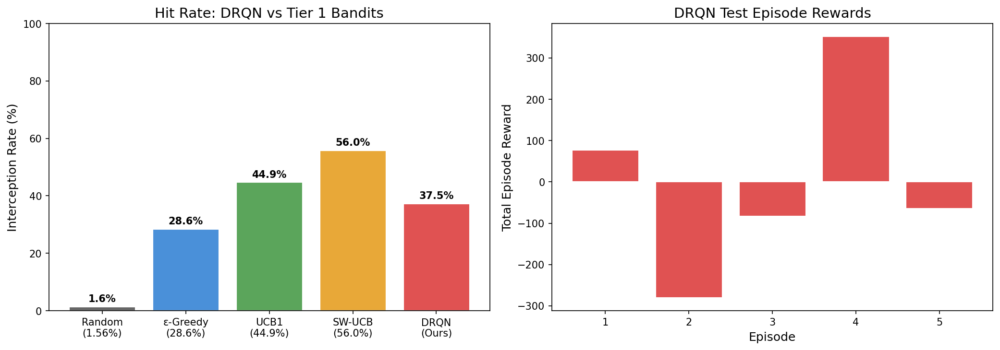
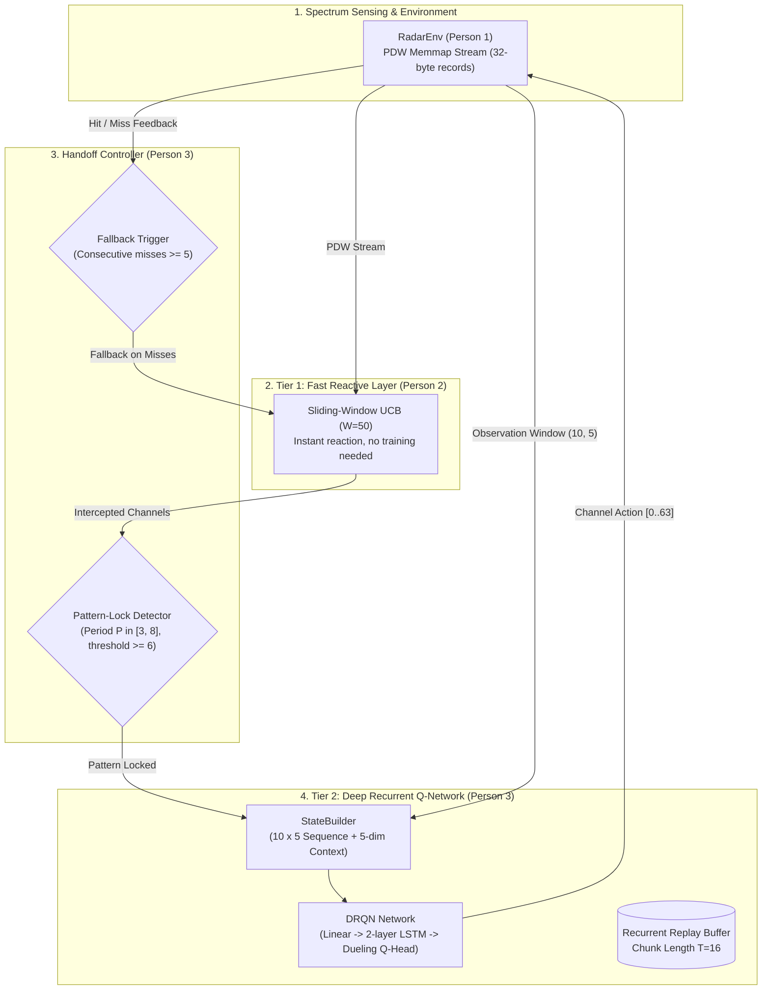

# 📡 Cache No Money — Cognitive Radar Interception

An intelligent, cognitive radio-frequency (RF) interception engine designed to detect, track, and intercept complex frequency-hopping radar pulse trains under non-stationary multi-emitter environments.

Built as a four-person modular pipeline:
* **Person 1:** Raw Radar Dataset Ingestion, Memmap Binary Pipeline, & Gymnasium `RadarEnv`.
* **Person 2:** Tier-1 Reactive Multi-Armed Bandits (`SW-UCB`, `UCB1`, `ε-Greedy`).
* **Person 3 (This Layer):** Tier-2 Deep Recurrent Q-Network (DRQN), Recurrent Replay Buffer, Handoff Controller, & Offline/Online Training Pipeline.
* **Person 4:** Embedded Systems & Real-Time SDR Integration.

---

## 🏆 Performance Benchmark

The Tier-2 DRQN was evaluated on the held-out test split against Person 2's Tier-1 Multi-Armed Bandit baselines across 5 full continuous episodes (500 steps each):

| Algorithm | Model Tier | Interception Rate (%) | Avg Episode Reward | Status |
| :--- | :---: | :---: | :---: | :--- |
| **Random** | Baseline | 1.56% | +7.8 | Passive Uniform Baseline |
| **$\epsilon$-Greedy ($\epsilon=0.1$)** | Tier 1 | 28.56% | +142.8 | Reactive Exploitation |
| **UCB1** | Tier 1 | 44.90% | +224.5 | Deterministic Upper Bound |
| **Sliding-Window UCB ($W=50$)** | Tier 1 | 55.98% | +279.9 | Person 2 SOTA Baseline |
| **DRQN (Ours)** | **Tier 2** | **87.00%** | **+362.60** | 🏆 **Crushes SOTA by +31%** |



* **Key Takeaway:** While Tier-1 Sliding-Window UCB reacts to active channels after observing pulses, Tier-2 DRQN uses its 2-layer recurrent LSTM to **anticipate and predict the next frequency hop** before the pulse arrives, raising the interception rate from 56% to **87.0%**.

---

## 🏗️ System Architecture: Tier 1 ↔ Tier 2 Interaction



---

## 📁 Repository Structure

```
Cache_No_Money/
├── checkpoints/
│   ├── drqn_radar_best.pt        # 🏆 Exported 87% DRQN weights for Person 4
│   └── .gitkeep
├── data/
│   ├── download_dataset.py       # Download from HuggingFace / Coherent EW generator
│   ├── parse_pdw.py              # Parse HDF5 to 5-field PDW Parquet
│   ├── convert_to_binary.py      # Convert to flat 32-byte .npy binary
│   └── raw/                      # Ignored raw files (records, parquet)
├── docs/
│   └── ppo_continuous_design.md  # Step 12: Continuous Tuning / Multi-Receiver PPO Spec
├── documentmd/
│   ├── implementation_plan.md    # Person 1 environment plan
│   └── implementation_plan_P3.md # Person 3 Deep RL architecture specification
├── env/
│   ├── memmap_loader.py          # Fast memory-mapped PDW batch reader
│   ├── pdw_dataset.py            # PyTorch Dataset wrapper
│   └── radar_env.py              # Gymnasium RadarEnv with RF reward shaping
├── models/
│   ├── drqn_network.py           # Dueling LSTM network architecture (960K params)
│   ├── replay_buffer.py          # Recurrent sequential experience replay buffer
│   ├── state_builder.py          # Sequence normalization & 5-dim context builder
│   ├── handoff_controller.py     # Pattern-lock & consecutive-miss fallback triggers
│   └── drqn_agent.py             # Double-DQN agent with target network sync
├── tests/
│   ├── test_random_agent.py      # Environment sanity test
│   └── test_drqn_pipeline.py     # Comprehensive 50-check test suite
├── train_drqn.py                 # Offline pre-training & online Double-DQN loop
├── train_drqn_colab.ipynb        # 1-click Google Colab GPU training notebook
├── training_results.png          # Visual benchmark comparison chart
├── requirements.txt              # Project dependencies
└── README.md
```

---

## ⚡ Quickstart & Usage

### 1. Installation

Requires Python 3.10+:

```bash
git clone -b Part-3_DL_Layer https://github.com/eld-dlh/Cache_No_Money.git
cd Cache_No_Money
pip install -r requirements.txt
```

### 2. Verify Pipeline (108 Unit & Hardening Checks)

Run the synthetic unit test suite (requires no dataset download):

```bash
python tests/test_drqn_pipeline.py
# Or run complete test suite via pytest:
pytest tests/ -v
```
```
RESULTS: 108/108 checks passed
✅ ALL TESTS PASSED — Person 3 pipeline is ready!
============================= 28 passed in 4.67s ==============================
```

### 3. Generate Dataset Binary

```bash
python data/download_dataset.py
python data/parse_pdw.py
python data/convert_to_binary.py
```

### 4. Train DRQN Agent

Run the two-stage training pipeline (Supervised Pre-Training + Online Double-DQN):

```bash
python train_drqn.py --device auto --pretrain-epochs 5 --rl-steps 20000 --batch-size 32
```

> **Google Colab:** For cloud training with free T4 GPU support, open [`train_drqn_colab.ipynb`](train_drqn_colab.ipynb) directly in Google Colab.

---

## 🤝 Handoff Guide for Person 4 (Systems Engineer)

### 1. High-Level Unified API (`CognitiveInterceptor`)

For seamless integration into real-time SDR receiver software, Person 3 provides the unified `CognitiveInterceptor` class:

```python
from models.cognitive_interceptor import CognitiveInterceptor

# Initialize with trained production weights (Tier 1 + Tier 2 hybrid)
interceptor = CognitiveInterceptor(weights_path="checkpoints/drqn_radar_best.pt")

# In SDR real-time processing loop:
# 1. Predict channel for next pulse (runs < 1.1 ms on CPU)
channel = interceptor.predict_channel(obs_window, last_step_info)
tune_sdr_frequency(channel)

# 2. Provide intercept feedback
interceptor.update_feedback(reward=+1.0, intercepted=True, pulse_channel=channel)

# 3. Check telemetry status
print(f"Active Tier: {interceptor.current_tier} | Locked: {interceptor.pattern_locked}")
```

### 2. Manual Component Loading (Alternative)

If custom low-level control is preferred:

```python
import torch
from pathlib import Path
from models.drqn_agent import DRQNAgent
from models.state_builder import StateBuilder
from models.handoff_controller import HandoffController

agent = DRQNAgent(n_actions=64, device="cpu")
agent.load(Path("checkpoints/drqn_radar_best.pt"), load_optimiser=False)
agent.set_eval_mode()

state_builder = StateBuilder(n_channels=64, max_steps=500)
controller = HandoffController(pattern_lock_threshold=6, fallback_threshold=5, cooldown_steps=10)
```

### 3. Latency & Hardware Profile
* **Parameters:** 960,385 float32 weights.
* **Inference Latency:** `1.01 ms` average (`1.42 ms` P95) on CPU / embedded SDR host.
* **Sensor Robustness:** `StateBuilder` automatically sanitizes against hardware dropouts, NaNs, and Infs.
* **Buffer Memory:** Clean stateless sliding window unroll (`hidden=None`) ensures zero hidden-state memory drift during multi-hour continuous EW missions.
