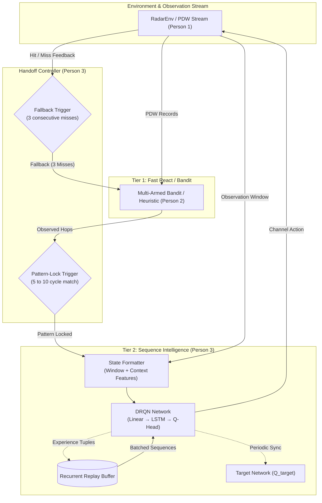

# Person 3 — Deep RL (Tier 2) Engineer: Implementation Plan

## Executive Summary

As the **Deep RL (Tier 2) Engineer**, your mission is to build the cognitive engine capable of learning complex, non-stationary radar hopping patterns that simple Tier 1 heuristics (e.g., Multi-Armed Bandits) cannot master. While Tier 1 quickly exploits stationary channels, **Tier 2 (DRQN)** leverages recurrent memory (LSTM) to predict the next frequency hop in agile, multi-emitter, and sequence-based radar scenarios.

This plan details the complete end-to-end design across all 13 required milestones, matching the architecture and standards established by Person 1.

---

## System Architecture: Tier 1 & Tier 2 Interaction



---

## Planned File Structure for Person 3

All new files will integrate cleanly into the existing workspace without mutating Person 1's files:

```
Cache_No_Money/
├── documentmd/
│   ├── implementation_plan.md        # Person 1 Plan (preserved)
│   └── implementation_plan_P3.md     # This Implementation Plan
├── models/
│   ├── __init__.py
│   ├── drqn_network.py               # Step 3: Input MLP -> LSTM -> Q-Value Head
│   ├── replay_buffer.py              # Step 4: Episode / Sequence Replay Buffer
│   ├── state_builder.py              # Step 1 & 2: Feature engineering & state builder
│   ├── handoff_controller.py         # Steps 9 & 10: Pattern-lock & Fallback triggers
│   └── drqn_agent.py                 # Steps 5, 6, 7: Epsilon-greedy, target net, agent step
├── train_drqn.py                     # Step 8: Offline / Online training loop & checkpointing
├── docs/
│   └── ppo_continuous_design.md      # Step 12: PPO Design Doc (Continuous/Multi-Receiver)
├── checkpoints/
│   └── drqn_radar_best.pt            # Step 11: Exported weights for Person 4
└── tests/
    └── test_drqn_pipeline.py         # Full unit test & sanity benchmark
```

---

## Detailed Implementation Breakdown (13 Steps)

### Step 1 — State Representation Design
The observation must inform the network not only about raw pulse attributes, but also about the agent's internal operational context:
- **Base Observation ($W \times 5$):** Sliding window of the last $W=10$ PDW pulses:
  - $\text{ToA}$ (inter-pulse interval $\Delta\text{ToA}$, normalized)
  - $\text{Frequency}$ (channel index or normalized MHz)
  - $\text{Pulse Width (PW)}$
  - $\text{Angle of Arrival (AoA)}$
  - $\text{Amplitude}$
- **Engineered Context Features (Vector $D_{\text{eng}} = 5$):**
  1. `recent_hit_rate`: Exponential moving average (EMA) of successful intercepts over the last 10 steps ($[0, 1]$).
  2. `consecutive_misses`: Integer count ($0$ to $3+$) normalized to $[0, 1]$.
  3. `last_action_channel`: One-hot or normalized channel index chosen at $t-1$ (captures retuning penalty state).
  4. `dwell_budget_remaining`: Normalized steps remaining in the current episode horizon ($t / T_{\max}$).
  5. `channel_occupancy_hist`: Short summary of recent emitter presence across frequency quadrants.
- **Combined Input:** Flattened pulse window ($10 \times 5 = 50$) concatenated with $D_{\text{eng}} (5)$ $\rightarrow$ input dimension $D_{\text{in}} = 55$. Alternatively, sequence input to LSTM: $(B, L, 5 + D_{\text{eng\_per\_step}})$.

---

### Step 2 — Action Space Design
- **Action Space:** `Discrete(64)` matching `RadarEnv.action_space`.
- **Optional Composite Action Mode:** Discrete set of $64 \times K$ actions if dwell-time buckets are enabled (e.g., $64 \text{ channels} \times 3 \text{ dwell durations: short, medium, long} = 192\text{ actions}$).
- **Default Baseline:** $A = 64$ discrete channels to maintain 100% interoperability with Person 1's `RadarEnv` and Person 2's benchmark.

---

### Step 3 — PyTorch DRQN Network Architecture
File: `models/drqn_network.py`
- **Architecture:**
  1. **Feature Extraction Layer:** Linear layer `(input_dim -> 128)`, LayerNorm, ReLU/GELU activation.
  2. **Recurrent Memory Layer:** 2-layer LSTM `(input_size=128, hidden_size=256, batch_first=True)`. Keeps internal state $(h_t, c_t)$ across time steps to decode frequency-hopping patterns (e.g., Costas arrays, pseudo-random sequences).
  3. **Advantage / Dueling Q-Value Head (Optional & recommended) or Standard Q-Head:**
     - Value stream: `Linear(256 -> 64) -> ReLU -> Linear(64 -> 1)`
     - Advantage stream: `Linear(256 -> 64) -> ReLU -> Linear(64 -> 64)`
     - $Q(s, a) = V(s) + \left(A(s, a) - \frac{1}{|A|}\sum_{a'} A(s, a')\right)$
  4. Output shape: Tensor of shape `(batch_size, seq_len, 64)` Q-values.

---

### Step 4 — Recurrent Experience Replay Buffer
File: `models/replay_buffer.py`
- **Replay Strategy:** Sequential / episodic replay buffer.
  - Standard DQN samples random transitions $(s_t, a_t, r_t, s_{t+1})$, which breaks LSTM recurrent state consistency.
  - The Recurrent Replay Buffer stores complete sequences or chunks of length $T_{\text{chunk}} = 16$ or $20$.
  - Fixed capacity: $N_{\text{seq}} = 10,000$ sequence chunks.
  - Supports zero-initialization or stored initial hidden states $(h_0, c_0)$ for replay burn-in.

---

### Step 5 — Target Network & Stability Mechanics
File: `models/drqn_agent.py`
- Dual network architecture: Main Q-Network $\theta$ and Target Q-Network $\theta^{-}$.
- **Sync Strategy:**
  - Hard periodic update: $\theta^{-} \leftarrow \theta$ every $C = 500$ environment steps.
  - Option for soft Polyak updates: $\theta^{-} \leftarrow \tau \theta + (1 - \tau)\theta^{-}$ with $\tau = 0.005$.
- Double DQN (DDQN) formulation:
  $$Y_t = r_t + \gamma \, Q(s_{t+1}, \operatorname{argmax}_a Q(s_{t+1}, a; \theta); \theta^{-})$$
  This eliminates Q-value overestimation bias.

---

### Step 6 — $\epsilon$-Greedy Exploration Schedule
- **Schedule:**
  - $\epsilon_{\text{start}} = 1.0$
  - $\epsilon_{\text{end}} = 0.05$
  - $\epsilon_{\text{decay\_steps}} = 20,000$ steps (linear or cosine decay)
- **Epsilon Policy:** Select $\operatorname{argmax}_a Q(s, a)$ with probability $1 - \epsilon$, uniform random action with probability $\epsilon$.
- Evaluation mode: $\epsilon = 0.0$ (pure exploitation).

---

### Step 7 — Training Loop & Loss Computation
- **Loss:** Smooth L1 Loss (Huber Loss) between predicted $Q(s_t, a_t)$ and target $Y_t$.
- **Optimizer:** AdamW (`lr=1e-4`, `weight_decay=1e-5`, `eps=1e-8`).
- **Gradient Clipping:** `torch.nn.utils.clip_grad_norm_(model.parameters(), max_norm=5.0)` to prevent exploding gradients in recurrent unrolls.

---

### Step 8 — Two-Stage Dataset & Environment Training
1. **Stage 8A: Offline Imitation / Pretraining (Memmap DataLoader):**
   - Utilize Person 1's `PDWDataset` with sliding window batches.
   - Self-supervised sequence prediction: train LSTM to predict next arriving pulse channel as warm-up weights.
2. **Stage 8B: Online RL in `RadarEnv`:**
   - Run agent in `RadarEnv(split='train')`.
   - Collect rollouts into Recurrent Replay Buffer.
   - Update model weights every 4 steps once buffer has $> 1,000$ transitions.
   - Periodic evaluation on `RadarEnv(split='test')` every 1,000 steps to check generalization on unseen pulse trains.

---

### Step 9 — Pattern-Lock Trigger (Tier 1 $\rightarrow$ Tier 2 Handoff)
File: `models/handoff_controller.py`
- **Objective:** Detect when pulse channel arrivals follow a predictable sequence (e.g., cyclic hopping $c_1 \to c_2 \to c_3 \to \dots$).
- **Algorithm:**
  1. Maintain a rolling sequence of the last $M = 16$ ground-truth or intercepted channel IDs.
  2. Run auto-correlation / prefix-suffix matching to find repeating period $P \in [3, 8]$.
  3. If $k$ consecutive hops ($5 \le k \le 10$) match an identified cyclical or Markov pattern, trip the **`PATTERN_LOCK`** flag (`True`).
  4. Send event: `"HANDOFF_TO_TIER_2"`. Tier 2 takes over action selection.

---

### Step 10 — Fallback Trigger (Tier 2 $\rightarrow$ Tier 1 Revert)
File: `models/handoff_controller.py`
- **Objective:** Safeguard against emitter mode switches, jamming, or policy failure.
- **Algorithm:**
  1. Track Tier 2's last 3 consecutive predictions: `window_intercepts = deque(maxlen=3)`.
  2. If all 3 steps result in `intercepted == False` (3 consecutive misses):
     - Trip the **`FALLBACK`** flag (`True`).
     - Clear pattern lock.
     - Reset DRQN hidden state $(h, c)$.
     - Send event: `"REVERT_TO_TIER_1"`. Hand control back to the Tier 1 Bandit.

---

### Step 11 — Model Checkpointing & Artifact Export
- Checkpoint directory: `checkpoints/`
- Checkpoint artifact: `drqn_radar_best.pt`
- Saved payload:
  ```python
  {
      "model_state_dict": model.state_dict(),
      "target_state_dict": target_model.state_dict(),
      "optimizer_state_dict": optimizer.state_dict(),
      "norm_stats": {"mean": ..., "std": ...},
      "config": {
          "input_dim": 55,
          "hidden_dim": 256,
          "n_actions": 64,
          "window_size": 10
      },
      "best_eval_reward": best_reward,
      "epoch": epoch
  }
  ```

---

### Step 12 — Design Document: PPO for Continuous / Multi-Receiver Interception
File: `docs/ppo_continuous_design.md` *(Documentation Only, No Implementation)*
- **Motivation:** Discrete DQN fails when:
  - Tuner frequency is continuous ($f \in [f_{\min}, f_{\max}]$) rather than binned.
  - Multiple receiver heads ($M$ receivers) must be coordinated simultaneously ($M$-dimensional action space).
- **Architecture:**
  - Actor Network: outputs parameters $(\mu, \sigma)$ of a Gaussian policy or Dirichlet policy over receivers.
  - Critic Network: Value baseline $V(s)$.
- **PPO Clipped Objective:**
  $$L^{\text{CLIP}}(\theta) = \hat{\mathbb{E}}_t \left[ \min(r_t(\theta)\hat{A}_t, \, \operatorname{clip}(r_t(\theta), 1-\epsilon, 1+\epsilon)\hat{A}_t) \right]$$
- **Multi-Receiver Coordination:** Centralized Training with Decentralized Execution (CTDE) or joint continuous action heads.

---

### Step 13 — Handoff Specifications for Person 4 (Systems Engineer)
- Deliver clean interface class: `CognitiveInterceptor`:
  ```python
  class CognitiveInterceptor:
      def __init__(self, weights_path: str): ...
      def predict_channel(self, obs: np.ndarray, info: dict) -> int: ...
      def update_feedback(self, reward: float, intercepted: bool): ...
  ```
- Latency budget: single-step inference $\le 2.0\text{ ms}$ on CPU/GPU.
- Handoff status indicators: expose `current_tier` (1 or 2), `pattern_locked` (bool), `consecutive_misses` (int).

---

## Verification & Sanity Gates

1. **Unit Test (`tests/test_drqn_pipeline.py`):**
   - Forward pass verification: `obs (1, 10, 5) -> action (1,)` produces valid integer in $[0, 63]$.
   - LSTM hidden state persistence and reset check.
   - Replay buffer write/sample shape and sequence integrity check.
2. **Trigger Test:**
   - Synthetic repeating sequence $12 \to 24 \to 36 \to 12 \dots$ must trigger `PATTERN_LOCK` within 8 pulses.
   - 3 consecutive forced misses must immediately trigger `FALLBACK`.
3. **Benchmark Test:**
   - 100-step test comparing Tier 2 against Person 1's random baseline (`test_random_agent.py`): intercept rate must substantially exceed the $1/64 \approx 1.56\%$ random rate.

---

## Handoff Artifact Checklist
- [ ] `models/drqn_network.py`
- [ ] `models/replay_buffer.py`
- [ ] `models/state_builder.py`
- [ ] `models/handoff_controller.py`
- [ ] `models/drqn_agent.py`
- [ ] `train_drqn.py`
- [ ] `checkpoints/drqn_radar_best.pt`
- [ ] `docs/ppo_continuous_design.md`
- [ ] `tests/test_drqn_pipeline.py`
